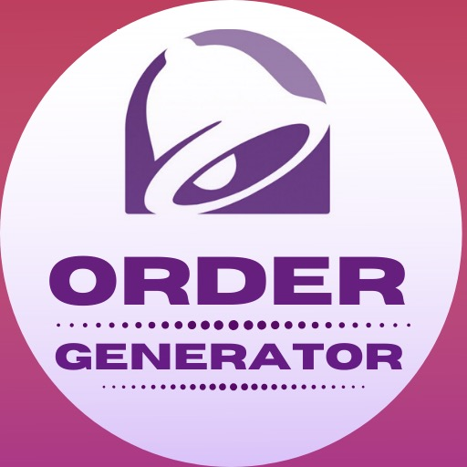

# CS125 Final - Taco Bell Order Generator
<!--
*** Thanks for checking out this README Template. If you have a suggestion that would
*** make this better, please fork the repo and create a pull request or simply open
*** an issue with the tag "enhancement".
*** Thanks again! Now go create something AMAZING! :D
***
***
***
*** To avoid retyping too much info. Do a search and replace for the following:
*** github_username, repo, twitter_handle, email
-->

<!-- PROJECT LOGO -->
 

  

  <h3 align="center">Taco Bell Order Generator</h3>
    ·
    <a href="https://github.com/sriramsridhar66/cs125final_tacobell/issues">Report Bug</a>
    ·
    <a href="https://github.com/sriramsridhar66/cs125final_tacobell/issues">Request Feature</a>
  

<!-- TABLE OF CONTENTS -->
## Table of Contents

* [About the Project](#about-the-project)
  * [Built With](#built-with)
* [Roadmap](#roadmap)
* [Contact](#contact)
* [Acknowledgements](#acknowledgements)

<!-- ABOUT THE PROJECT -->
## About The Project

Creates a partially randomized Taco Bell order based on a few user inputs.

### Built With

* [Java](https://docs.oracle.com/javase/8/docs/technotes/guides/language/index.html)
* [Android Studio](https://developer.android.com/studio)
* [Jsoup](https://jsoup.org/)

<!-- ROADMAP -->
## Roadmap

* Complete logic to choose menu items.

<!-- CONTACT -->
## Contact

* Sriram Sridhar - srirams5@illinois.edu
* Keesan Patel - don't

<!-- ACKNOWLEDGEMENTS -->
## Acknowledgements

* [Mark King](https://www.linkedin.com/in/mark-king-751a93111)

<!-- MARKDOWN LINKS & IMAGES -->
<!-- https://www.markdownguide.org/basic-syntax/#reference-style-links -->
[product-screenshot]: images/screenshot.png
